# factory-infrastructure — Crate Overview

> **Source**: `crates/factory-infrastructure/src/lib.rs`
> **Layer**: Infrastructure (Onion Architecture — outermost concrete layer)

---

## Adapter Registry

```mermaid
graph TB
    LIB["lib.rs: Adapter Traits + Re-exports"]

    subgraph "Platform Adapters"
        GH["github.rs: GitHub REST API"]
        GL["gitlab.rs: GitLab REST API"]
        JR["jira.rs: Jira Cloud API"]
    end
    subgraph "Messaging"
        KF["kafka.rs: KRaft Producer/Consumer"]
    end
    subgraph "Security"
        ZT["ziti.rs: OpenZiti Zero-Trust"]
        VT["vault.rs: HashiCorp Vault"]
        SV["security_validator.rs: Ed25519"]
    end
    subgraph "Observability"
        SN["sentry.rs: Error Tracking"]
        S3["s3.rs: Object Storage"]
    end
    subgraph "AI/ML"
        R2R["r2r.rs: GraphRAG"]
        MPC["mcp_client.rs: MCP Protocol"]
        SEM["semantica.rs: Semantic Search"]
    end
    subgraph "Execution"
        AE["aethalgard.rs: Circuit Breaker"]
        CS["cursor_store.rs: Poll State"]
        GP["git_poller.rs: Change Detection"]
        PC["pipeline_classifier.rs: Error Taxonomy"]
    end

    LIB --> GH
    LIB --> GL
    LIB --> KF
    LIB --> ZT
    LIB --> R2R
    LIB --> AE

    style LIB fill:#FF9800,stroke:#E65100,color:#fff
```

## Key Traits

| Trait | Module | Purpose |
|:---|:---|:---|
| `KafkaClient` | `kafka.rs` | Publish/consume Kafka messages |
| `SecurityValidator` | `security_validator.rs` | Ed25519 signature verification |

---

> *Related: [Tactical Design](../../architecture/tactical_design.md) · [Strategic Design](../../architecture/strategic_design.md)*
