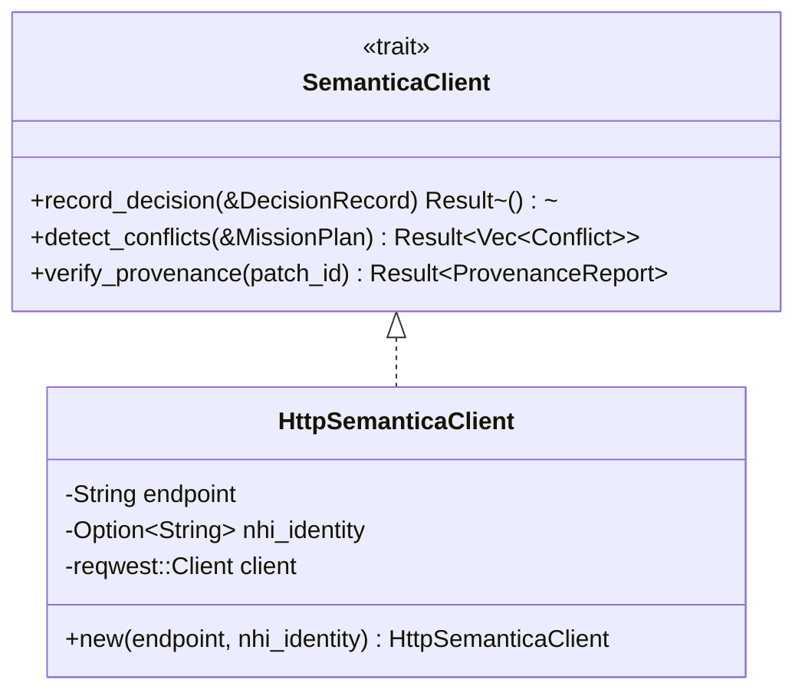

# factory-infrastructure::semantica — Semantica Decision & Conflict Client

> **Source**: `crates/factory-infrastructure/src/semantica.rs`  
> **Layer**: Infrastructure  
> **Role**: HTTP adapter for the Semantica service providing decision provenance, mission plan conflict detection, and patch causal chain verification.

---

## SemanticaClient Trait & Endpoints

## Endpoints

| Method | Endpoint | Description |
|:---|:---|:---|
| `POST` | `/v1/decisions` | Appends an immutable decision record with AST node associations. |
| `POST` | `/v1/conflicts/detect` | Evaluates proposed mission tasks against architectural rules. |
| `GET` | `/v1/provenance/{patch_id}` | Verifies causal provenance and constitutional policy compliance. |

---

> *Related: [semantica_bridge.rs](../application/bridge/semantica_bridge.md) · [Infrastructure Adapters](../../architecture/infrastructure_adapters.md)*
