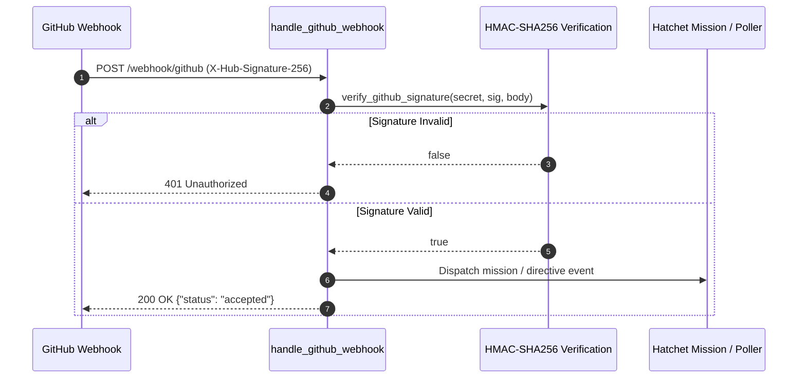

# factory-mcp-server::github_webhook — GitHub Webhook Ingress Route

> **Source**: `crates/factory-mcp-server/src/github_webhook.rs`  
> **Layer**: Interface  
> **Role**: HMAC-SHA256 authenticated Axum webhook endpoint listening for GitHub issue and PR comment events to dispatch into the autonomous factory.

---

## Webhook Verification Flow

---

> *Related: [McpServer](lib.md) · [Tactical Design](../../architecture/tactical_design.md)*
