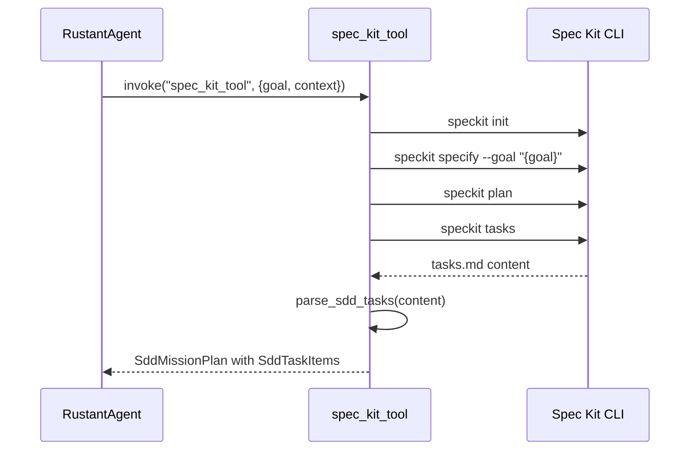

# Spec Kit MCP Tool — Comprehensive Documentation

> **Purpose**: Bridges MCP protocol to Spec-Kit SDD workflow for autonomous mission planning and execution.

---

## Tool Interface

| Field | Value |
|:---|:---|
| **MCP Tool Name** | `spec_kit_tool` |
| **Category** | Planning |
| **Authorized Agents** | RustantAgent |
| **Input** | Goal description + codebase context |
| **Output** | SDD artifacts (spec.md, plan.md, tasks.md) |

## SDD Workflow Bridge

---

> *Related: [RustantAgent](../../application/agents/rustant.md) · [Tactical Design](../../../architecture/tactical_design.md)*
