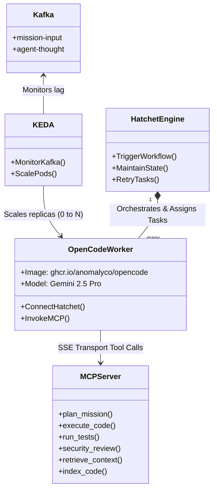
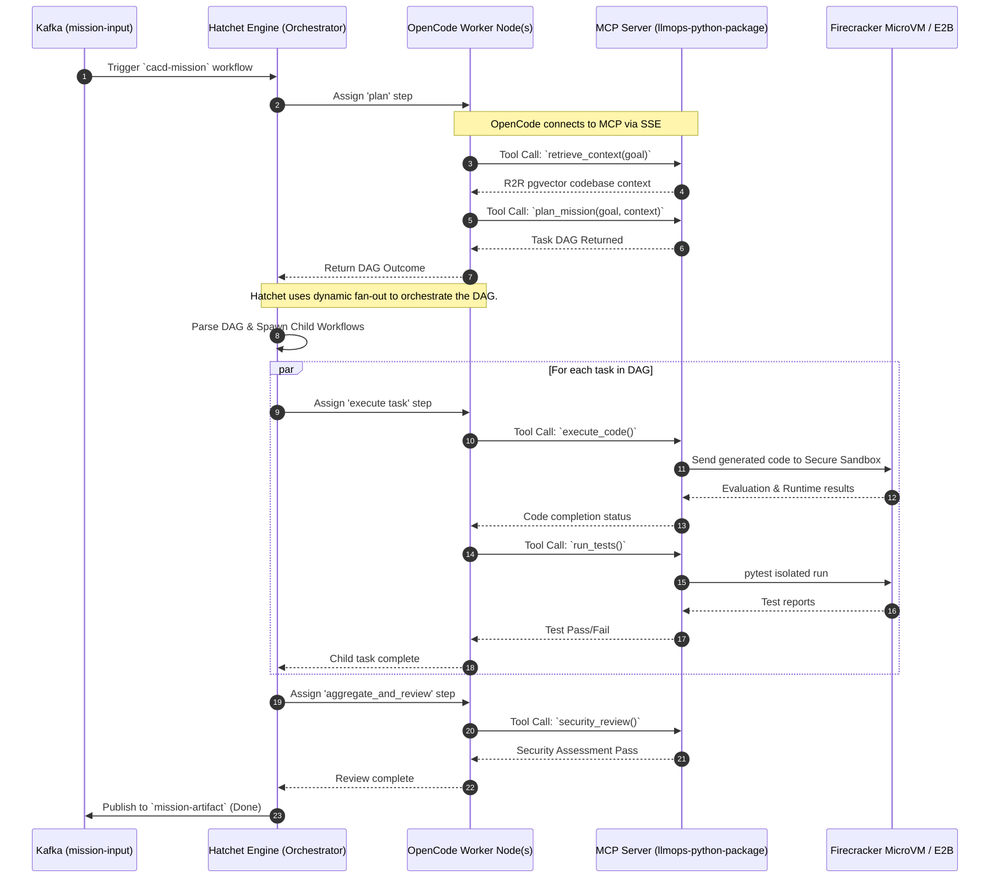

# OpenCode Integration in CA/CD Factory

This document explains how the OpenCode agent is integrated and executed within the project's Autonomous Agent Factory.

## Architecture & Integration (UML)

The `OpenCode` agent acts as a native Hatchet Worker. It connects to our consolidated Python MCP server over SSE to execute domain-specific tools. KEDA monitors event queues and scales the OpenCode pods accordingly.



## Execution Flow

When a mission is triggered, Hatchet establishes the durable state. In the `plan` step, an OpenCode worker generates a Directed Acyclic Graph (DAG) using the Planner Agent's capabilities via MCP.

**Critical Control Flow:** Hatchet then natively parses this DAG (via `fan_out_tasks`) to spawn dedicated parallel child workflows for each coding task. OpenCode workers process these individual child tasks, invoking the testing and reviewing tools before Hatchet aggregates the final outcome.



## Local Development Usage

To run the full stack locally, connecting the OpenCode worker to the local Python MCP Server:

1. **Start the MCP Server:**
   This provisions the `llmops-factory` via stdio or SSE.

   ```bash
   poetry run invoke projects.mcp
   ```

2. **Configure OpenCode:**
   Ensure your local OpenCode instance is configured to point to the local MCP server via your `opencode.json` configuration file, utilizing the `http://localhost:8000/sse` endpoint for tool access.
3. **Trigger Mission:**
   Publish an event to the Hatchet backend or the Kafka `mission-input` topic to instantiate an OpenCode worker response.
