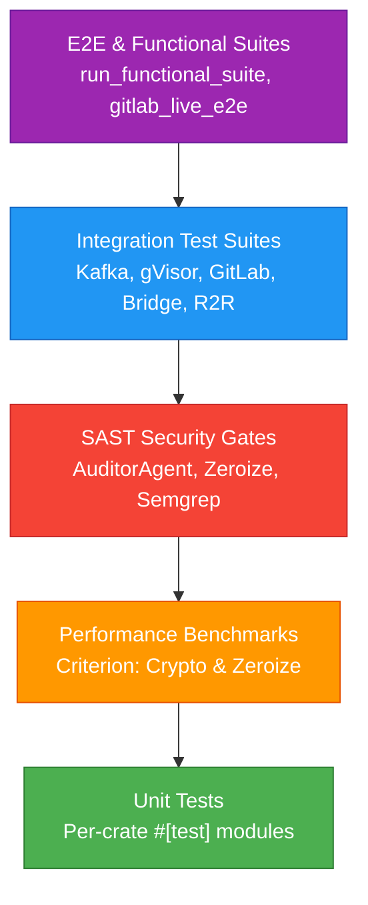

# Test Plan & Quality Report — Dark Gravity CA/CD Factory

> **Purpose**: Formal test plan, test suite catalog, integration matrix, benchmark documentation, and SAST security gate report following ISO 25010 and ISO 29119 software quality assurance standards.

---

## 1. Test Pyramid & Quality Strategy



---

## 2. Integration Test Suites Catalog

The workspace contains dedicated integration tests validating end-to-end multi-agent orchestration, network boundary security, and third-party integrations:

| Crate | Test Suite File | Coverage Target | Key Scenarios Tested |
|:---|:---|:---|:---|
| `factory-application` | `tests/functional_e2e_test.rs` | Full Factory Pipeline | End-to-end issue ingestion, task decomposition, and PR generation |
| `factory-application` | `tests/hatchet_sdd_task_orchestration_test.rs` | Hatchet DAG Engine | Multi-step task dependency execution and state handoffs |
| `factory-application` | `tests/bridge_test.rs` | ADK & Bridge State | Bidirectional event translation between ADK and Kafka |
| `factory-application` | `tests/gitlab_e2e_integration_test.rs` | GitLab CI / Webhooks | MR creation, webhook parsing, pipeline verification |
| `factory-application` | `tests/gitlab_live_e2e.rs` | Live GitLab API | Real API handshake, project permissions, and commit statuses |
| `factory-application` | `tests/mr_command_dispatch_tests.rs` | Directives Engine | `@darkgravity /spec`, `/refine`, `/status`, `/validate` |
| `factory-application` | `tests/mr_comment_conversation_tests.rs` | Conversational Threads | Multi-turn feedback loops on active MR discussions |
| `factory-application` | `tests/workflow_tests.rs` | Workflows | Circuit breaker trips, remediation cascades |
| `factory-application` | `tests/zeroclaw_sast_integration.rs` | Dev Agent SAST | Pre-commit security audits within the sandbox execution loop |
| `factory-core` | `tests/security_tests.rs` | NHI Primitives | Ed25519 signature issuance, tampering detection, replay rejection |
| `factory-core` | `tests/pr_directive_tests.rs` | Directive Parsing | Regex extraction and AST tokenization of comment directives |
| `factory-infrastructure` | `tests/kafka_integration.rs` | KRaft Messaging | High-throughput partition consumer group failover |
| `factory-infrastructure` | `tests/git_poller_reaction_tests.rs` | Poller Daemon | Issue label triggers (`autonomous-mission`, `dark-gravity`) |
| `factory-infrastructure` | `tests/mr_reaction_tests.rs` | Merge Request Poller | Unhandled comment detection and state cursor updates |
| `factory-mcp-server` | `tests/gvisor_integration.rs` | Sandbox Isolation | `runsc` syscall filtration and container security boundaries |
| `factory-mcp-server` | `tests/security_tests.rs` | MCP Server Endpoints | HMAC-SHA256 webhook authentication and Ziti zero-trust |

---

## 3. Performance Benchmarks

Criterion benchmark suites in `factory-core/benches`:

1. **`crypto_benchmark.rs`**:
   - Evaluates Ed25519 signing and verification throughput for Non-Human Identity (NHI) credentials.
   - Target: `< 150 µs` per credential verification under heavy load.
2. **`zeroize_benchmark.rs`**:
   - Assesses memory scrubbing speed for cryptographic secrets and sensitive tokens.
   - Ensures zeroization does not cause pipeline latency bottlenecks.

```bash
# Execute Criterion benchmarks
cargo bench --package factory-core
```

---

## 4. Quality Gates & Test Execution

```bash
# 1. Run all unit and integration tests across the workspace
cargo test --workspace --all-targets

# 2. Run functional E2E test suite specifically
cargo run --bin run_functional_suite

# 3. Code coverage generation with llvm-cov
cargo llvm-cov --workspace --html --output-dir target/coverage

# 4. SAST and Lint verification
cargo clippy --workspace --all-targets -- -D warnings
cargo fmt --all -- --check
```

---

> *Related: [VERIFICATION-TRIAD.md](../security/verification_triad.md) · [QAObserverAgent](../modules/application/agents/qa_observer.md) · [HITL Governance](../security/hitl_governance.md)*
