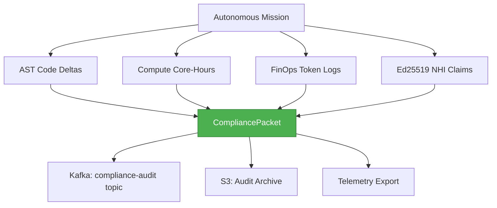

# Compliance & Audit — Dark Gravity CA/CD Autonomous Factory

> **Purpose**: R&D grant compliance framework documentation covering Hazitek 2026, EU AI Act, and automated telemetry audit trail packaging.

---

## 1. Regulatory Framework

| Regulation | Scope | Factory Compliance |
|:---|:---|:---|
| **Hazitek 2026 (SPRI)** | Basque Country R&D innovation grant | AST code deltas, compute hours, innovation output metrics |
| **EU AI Act Art. 12** | Transparency: logging of AI system operations | Mission event logging, agent action audit trail |
| **EU AI Act Art. 14** | Human oversight of high-risk AI systems | 4-Vertex HITL governance mesh, merge prohibition |

---

## 2. Automated Telemetry Packager

The factory automatically generates compliance evidence packets for each autonomous mission:



### CompliancePacket Data Model

```rust
// From data-model.md Entity 4
pub struct CompliancePacket {
    pub mission_id: String,
    pub grant_program: String,       // "Hazitek 2026", "SPRI", "EU AI Act Art. 12 & 14"
    pub ast_deltas: ASTDeltaSummary, // Lines added, modified, removed
    pub compute_hours: ComputeMetrics, // CPU core-hours, RAM, sandbox duration
    pub finops_spend: FinOpsRecord,  // Token counts, USD equivalent
    pub nhi_credential: Ed25519Claim, // Signed verifiable credential
}
```

---

## 3. AST Code Mutation Tracking

Every code change is tracked at the AST level:

| Metric | Source | Purpose |
|:---|:---|:---|
| Lines Added | `git diff --stat` | Quantify R&D output |
| Lines Modified | `git diff --stat` | Track iteration effort |
| Lines Removed | `git diff --stat` | Measure refactoring activity |
| Symbols Modified | Tree-sitter AST parse | Track function/struct/trait changes |
| Error Fingerprint | `ErrorClassification.error_fingerprint` | Deduplicate remediation attempts |

---

## 4. Compute Core-Hours Tracking

Sandbox compute usage is tracked for grant reporting:

| Metric | Source | Grant Relevance |
|:---|:---|:---|
| CPU Core-Hours | `SandboxConstraint.max_cpu_cores × duration` | R&D investment evidence |
| RAM Allocation | `SandboxConstraint.max_memory_mb` | Infrastructure cost justification |
| Sandbox Duration | Pod lifecycle timestamps | Compute time accounting |
| gVisor Overhead | Runtime class metrics | Security investment documentation |

---

## 5. FinOps Token Consumption

LLM token usage is attributed via `FinOpsTag` virtual headers:

```rust
// From factory-core
pub struct FinOpsTag {
    pub team: String,          // "dark-gravity"
    pub epic: String,          // "HAZITEK-2026-001"
    pub microservice: String,  // "factory-mcp-server"
    pub environment: String,   // "production"
    pub cost_center: String,   // "r-and-d"
}

// Serialized as HTTP headers:
// x-vtags-team: dark-gravity
// x-vtags-epic: HAZITEK-2026-001
// x-vtags-microservice: factory-mcp-server
// x-vtags-environment: production
// x-vtags-cost-center: r-and-d
```

Budget enforcement via `DailyBudgetConfig`:
- **Max daily budget**: $50 USD
- **Hardstop threshold**: 90% of daily budget
- **Velocity alert**: > $1.00/min spend rate

---

## 6. Ed25519 Cryptographic Identity Claims

Every mission includes a cryptographically signed verifiable credential:

| Field | Description |
|:---|:---|
| **Issuer** | Factory NHI Issuer (Ed25519 public key) |
| **Subject** | Mission ID |
| **Claim** | Agent name, action type, timestamp |
| **Signature** | Ed25519 signature over claim payload |
| **Encoding** | Base64 URL-safe no-pad |

This provides non-repudiable evidence that a specific agent performed a specific action at a specific time — critical for EU AI Act Art. 12 transparency requirements.

---

## 7. Audit Trail Export Format

Compliance packets are exported in JSON format to Kafka and S3:

```json
{
  "mission_id": "550e8400-e29b-41d4-a716-446655440000",
  "grant_program": "Hazitek 2026",
  "ast_deltas": {
    "lines_added": 142,
    "lines_modified": 28,
    "lines_removed": 15,
    "symbols_modified": ["PipelineScopeFilter", "evaluate_github"]
  },
  "compute_hours": {
    "cpu_core_hours": 0.125,
    "ram_mb_hours": 3.75,
    "sandbox_duration_secs": 1800
  },
  "finops_spend": {
    "prompt_tokens": 15420,
    "completion_tokens": 8230,
    "total_usd": 0.47
  },
  "nhi_credential": {
    "issuer": "ed25519:pk_abc123...",
    "signature": "base64url:sig_xyz789...",
    "timestamp": "2026-09-30T12:00:00Z"
  }
}
```

---

> *Related: [HITL Governance](hitl_governance.md) · [Security Architecture](security_architecture.md) · [Business Context](../architecture/business_context.md)*
