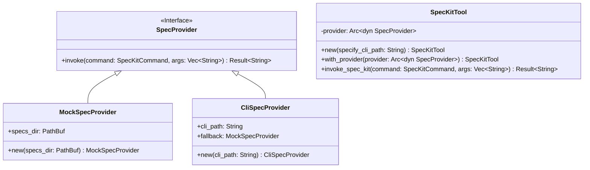
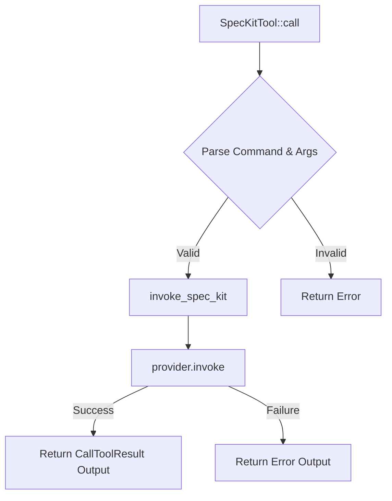

Source File: `crates/factory-mcp-server/src/tools/spec_kit_tool.rs`

# spec_kit_tool

## Component Overview
The `spec_kit_tool` module implements an MCP `Tool` trait that enables the agent to invoke the `specify` CLI. It defines a `SpecProvider` trait to allow dynamic switching between executing the real CLI (`CliSpecProvider`) and generating mock outputs (`MockSpecProvider`). This robust design ensures the tool falls back gracefully in environments where the CLI is unavailable.

## UML Diagram

## Execution Flow

