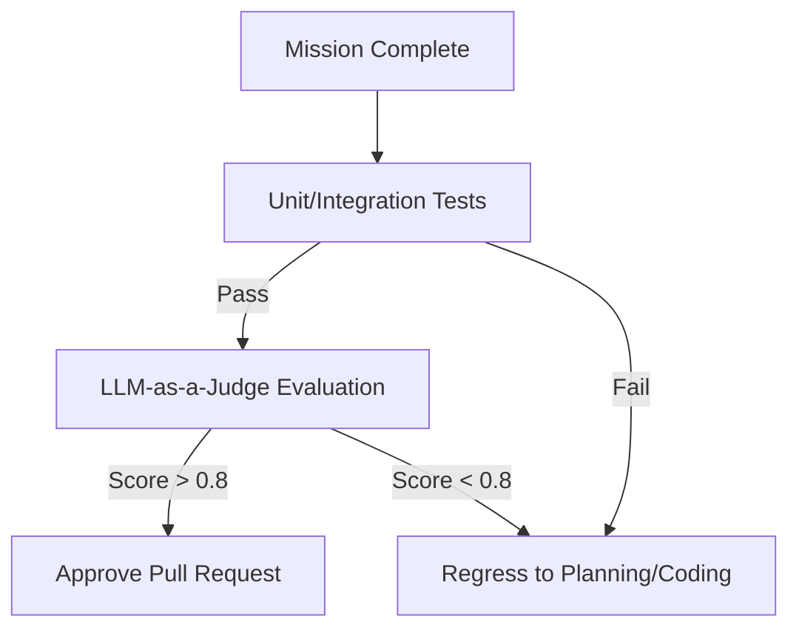
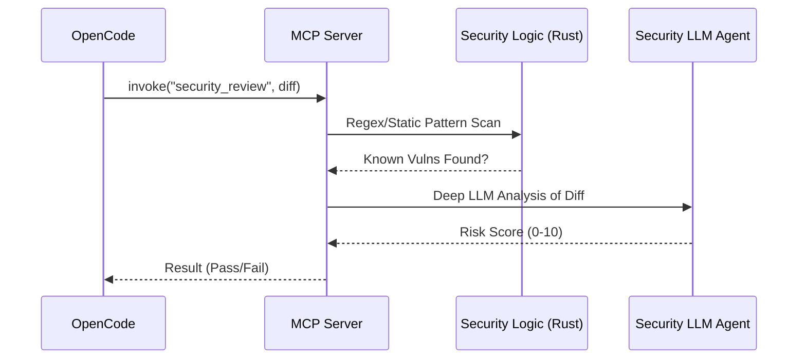

# 🧪 Testing Strategy: Dark Gravity CA/CD

## 🏗️ Multi-Layer Verification Hierarchy

Our testing strategy ensures code quality and mission success through a tiered approach, from low-level unit tests to high-level LLM evaluation.

| Layer | Focus | Key Tooling |
| :--- | :--- | :--- |
| **Unit Tests** | Crate-level logic, protocol parsing, and utilities. | `cargo test` |
| **Integration Tests** | Service-to-service communication (LiteLLM, R2R). | `mockito`, `testcontainers` |
| **Functional Tests** | MCP tool execution and result validation. | `factory-cli`, `pytest` |
| **LLM Eval (LLMOps)** | Mission accuracy, reasoning, and security. | `DeepEval`, `Ragas` |

---

## 📐 Testing Methodology

The system uses a tiered testing approach to ensure 100% mission reliability and **95% code coverage** across all infrastructure components.

### 🔌 Infrastructure Layer (Adapters)

We use **`wiremock`** and **`mockall`** to verify external integrations without making real network calls.

- **WireMock**: Used to spin up an HTTP server that mimics **GitHub/GitLab** or **R2R** responses. This validates our `reqwest` client logic and error handling (401, 404, 500).
- **MockAll**: Used to generate trait-based mocks for unit tests in the `Application` and `Interface` layers.
- **Coverage**: ALL infrastructure clients (`HttpGitHubClient`, `HttpGitLabClient`, `HttpR2rClient`) MUST maintain **95%+ unit test coverage**.

---

## 🔍 Unit & Integration Testing in Rust

Each crate in `crates/` includes its own `tests/` directory or inline `#[cfg(test)]` modules.

### 🛠️ Mocking External Services (Phase 3-4)

For testing the `factory-infrastructure` crate, we use `mockito` to simulate external API responses from LiteLLM and R2R.

```rust
#[tokio::test]
async fn test_retrieve_context_success() {
    let mut server = mockito::Server::new();
    let _m = server.mock("POST", "/v3/retrieval/search")
        .with_status(200)
        .with_body(r#"{"results": []}"#)
        .create();

    let client = R2RClient::new(server.url());
    let result = client.search("test query").await;
    assert!(result.is_ok());
}
```

---

## 🤖 LLM Evaluation (LLMOps Specifics)

Standard code tests are insufficient for measuring an autonomous factory's performance. We employ **LLM-as-a-Judge** metrics to evaluate mission quality.

### 📏 Key Metrics

1. **Correctness**: Does the generated code fulfill all acceptance criteria from the GitHub mission issue?
2. **Faithfulness (RAG)**: Is the code generated based on the retrieved context, or is the model hallucinating new patterns?
3. **Security Score**: Does the `SecurityReviewTool` flag the mission?
4. **Token Efficiency**: Reaching the goal with the minimum number of LLM calls.

### 🗺️ Verification Workflow



---

## 🛡️ Security Testing & Guardrails

The `SecurityReviewTool` performs **Static Application Security Testing (SAST)** and uses LLM-based analysis to detect:

- SQL Injection.
- Command Injection.
- Hardcoded Secrets.
- Unsafe Dependency usage.

### 🛡️ Guardrail Workflow



---

## 🚀 How to Run Tests

### 1. Local Rust Tests

```bash
# Run all tests in the workspace
cargo test

# Run tests for a specific crate (e.g., mcp-server)
cargo test -p factory-mcp-server
```

### 2. Mocking Integration

We provide a standalone mock service for local development:

```bash
cargo run -p factory-cli -- mock-server --port 8080
```
